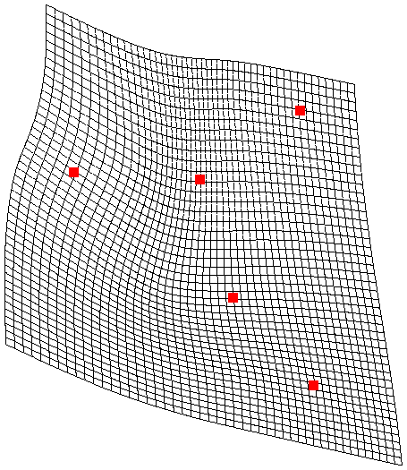

Introduction
############

This library is a direct implementation of the article of Bookstein [Bookstein1989]_.

This library is composed of a Python and a Cython version of all functions. The Python version have been coded for simplicity and portability, and the Cython version for performance issues.

The main wrapper will select the TPS core module automatically (the Cython version if available, otherwise the Python one). This module offer also a common API for all core functions (the Python and Cython function could be called directly, but not recommended).

The image projection can only be used if the Cython module is loaded (to heavy for the Python version).

The Cython module is composed of Cython wrapper functions, and Pure-C core functions (not callable from Python, but only from the Cython wrapper functions).

Example
~~~~~~~

If we use the example given in the original article, we can produce the TPS projection map as follow:

.. code::

    >>> from TPS import TPS_generate
    
    >>> src = [ [ 3.6929, 10.3819 ], [ 6.5827, 8.8386 ], [ 6.7756, 12.0866 ], [ 4.8189, 11.2047 ], [ 5.6969, 10.0748 ] ]
    >>> dst = [ [ 3.9724,  6.5354 ], [ 6.6969, 4.1181 ], [ 6.5394,  7.2362 ], [ 5.4016,  6.4528 ], [ 5.7756,  5.1142 ] ]
    
    >>> g = TPS_generate( src, dst )
    
The `g` dict will contain all important information:

.. code ::
    
    {
         'dst': array(
             [[ 3.9724,  6.5354],
             [ 6.6969,  4.1181],
             [ 6.5394,  7.2362],
             [ 5.4016,  6.4528],
             [ 5.7756,  5.1142]]),
         'src': array(
             [[  3.6929,  10.3819],
             [  6.5827,   8.8386],
             [  6.7756,  12.0866],
             [  4.8189,  11.2047],
             [  5.6969,  10.0748]]),
             
        'be': 0.0429994895805986,
        'linear': array(
            [[ 1.35499582, -2.94596308],
             [ 0.87472587, -0.29556056],
             [-0.02886041,  0.92163259]]),
        'weights': array(
             [[-0.03803014,  0.04244693],
             [ 0.02318775,  0.01591661],
             [-0.02475506,  0.02881348],
             [ 0.07978226, -0.04542552],
             [-0.04018482, -0.0417515 ]])
        
        'shearing': 250.32963702546,
        'scale': 0.8931102258056604,
    }

As available in the article, the `Bending Energy` is:

.. code::

    >>> pprint( g[ 'be' ] )
    0.0430

The weights in the `x` axis are:

.. code::

    >>> pprint( g[ 'weights' ][ :, 0 ] )
    ['-0.0380', '0.0232', '-0.0248', '0.0798', '-0.0402']

and on the `y` axis:

.. code::

    >>> pprint( g[ 'weights' ][ :, 1 ] )
    ['0.0424', '0.0159', '0.0288', '-0.0454', '-0.0418']

The linear part is:

.. code::

    >>> pprint( g[ 'linear' ][ :, 0 ] )
    ['1.3550', '0.8747', '-0.0289']
    
    >>> pprint( g[ 'linear' ][ :, 1 ] )
    ['-2.9460', '-0.2956', '0.9216']

.. note::

    A small difference is visible in the results in respect of the original article, probably due to higher precision in the modern math library used (Numpy and BLAS) or rounding effect in the source and destination vectors.

It's possible to create the distortion grid based on the TPS parameters as follow:

.. code::

	>>> grid = TPS_Grid( 
	    g = g,
	    minx = 3.8,
	    maxx = 8.6,
	    miny = 8,
	    maxy = 12.5,
	    res = 2500,
	    major_step = 0.1,
	    minor_step = 0.01
	 )

The resulting grid can be see with the `grid.show()` command:

This grid shows the orthogonal grid placed on the source data, and distorted with the TPS parameters to align the source points on the destination points. The destination points are shown on the distortion grid in red.

Remark
~~~~~~
	
The `pprint` function is defined as follow:

.. code::
	
	def pprint( data ):
	    def f( data ):
	        return "%.4f" % data
	    
	    try:
	        print f( data )
	    except:
	        print map( f, data ) 

References
~~~~~~~~~~

.. [Bookstein1989] Bookstein, F. L. (1989). Principal warps: Thin-plate splines and the decomposition of deformations. IEEE Transactions on Pattern Analysis and Machine Intelligence, Vol. 11 (6), pp. 567--585
